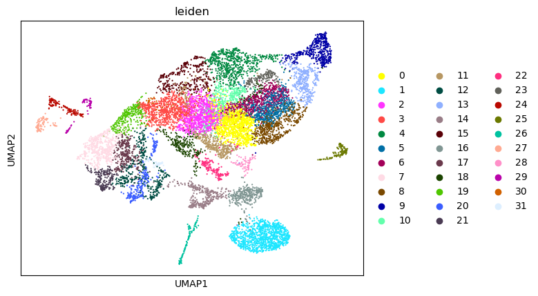
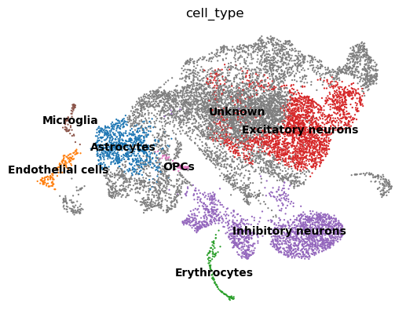
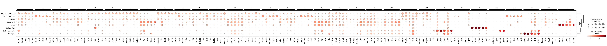
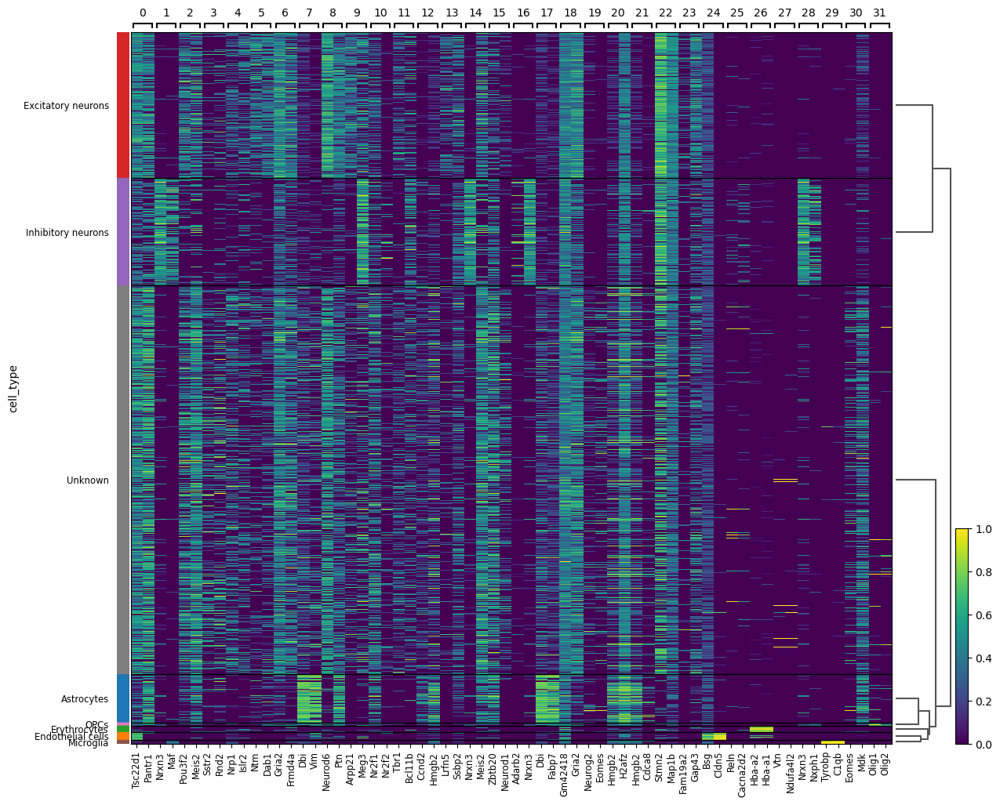

# Neuronal Single-Cell RNA-seq Analysis with Scanpy

This repository contains a single-cell RNA sequencing (scRNA-seq) analysis pipeline for mouse neuronal cells using the Python package **Scanpy**.

The project demonstrates a typical scRNA-seq workflow including data preprocessing, dimensionality reduction, clustering, marker gene identification, and biological cell-type annotation.

---

## Project Structure

```
neuronal-single-cell-scanpy/
│
├── notebooks/
│ neuronal_analysis.ipynb
│
├── figures/
│ umap_clusters.png
│ umap_celltypes.png
│ dotplot__marker_dotplot.png
│ heatmap_marker_heatmap.png
│
├── data/
│ neuron_10k_v3_filtered_feature_bc_matrix.h5
│ README.md
|
├── README.md
├── LICENSE
└── .gitignore
```
---

## Dataset

The dataset used in this analysis is the **10k Mouse Brain Cells (v3 chemistry)** dataset from **10x Genomics**.

It contains gene expression profiles for approximately **10,000 individual cells** obtained using droplet-based single-cell RNA sequencing.

---

## Analysis Workflow

The notebook performs the following steps:

### 1. Data Loading
- Import gene expression count matrix
- Create an AnnData object

### 2. Quality Control
- Filter low-quality cells
- Remove genes with low expression
- Visualize QC metrics

### 3. Normalization
- Library size normalization
- Log transformation

### 4. Feature Selection
- Identify highly variable genes

### 5. Dimensionality Reduction
- Principal Component Analysis (PCA)

### 6. Graph Construction
- Compute nearest-neighbor graph

### 7. Clustering
- Leiden clustering algorithm

### 8. Visualization
- UMAP embedding
- Cluster visualization

### 9. Marker Gene Identification
- Differential expression analysis
- Identification of cluster-specific marker genes

### 10. Cell Type Annotation
- Assign biological cell types based on marker genes

---

## Key Results

### UMAP Clustering

Cells cluster into transcriptionally distinct populations.



---

### Annotated Cell Types

Clusters were annotated based on known marker genes.



---

### Marker Gene Dotplot

Cluster-specific marker genes highlight transcriptional differences between cell populations.



---

### Marker Gene Heatmap

Expression patterns of top marker genes across annotated cell types.



---

## Requirements

Main Python packages used:


scanpy
anndata
numpy
pandas
matplotlib


Install dependencies:

```
pip install -r requirements.txt
```

---

## Running the Analysis

Clone the repository:

```
git clone https://github.com/ibrahim101-cyber/neuronal-single-cell-scanpy.git
cd neuronal-single-cell-scanpy
```
Then open the notebook:

```
jupyter notebook notebooks/neuronal_analysis.ipynb
```

Run the notebook from top to bottom to reproduce the analysis.

---

## Skills Demonstrated

- Single-cell RNA-seq analysis
- Data preprocessing and quality control
- Dimensionality reduction (PCA, UMAP)
- Graph-based clustering (Leiden)
- Marker gene identification
- Biological cell type annotation
- Data visualization in Python
- Reproducible computational workflows

---
## License

This project is distributed under the MIT License.
